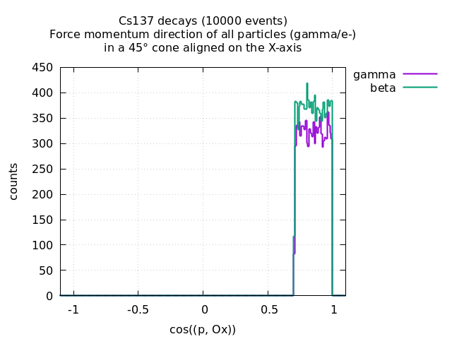
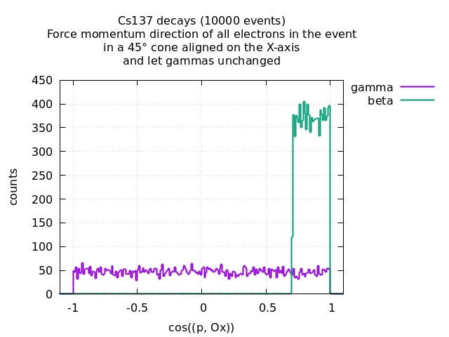

=========================================================
Momentum Direction Lock post-generation event operation
=========================================================

:author: F.Mauger
:date: 2021-05-13

This mechanisms allows to bias the angular distribution of the emitted
particles in  the BxDecay0  generated events. It  should be  used with
care  because  it  can  possibly corrupt  the  interpretation  of  the
simulated event.

Two modes are available:

* *target particle* mode  : An unique particle in the  event is chosen
  from a given type (e-, gamma... all types) and its rank in the event
  (mandatory: 0, 1,...).  Its momentum  is then forced to point within
  the requested  emission cone speficied by  its longitude, colatitude
  and  aperture angles.   All other  particles in  the event  are also
  rotated  in   such  a  way   one  preserves  the   possible  angular
  correlations  between emitted  particles  in  the original  BxDecay0
  generated event.  This  mode thus performs some kind  of solid angle
  preference sampling and could be used to track in Geant4 only events
  with a favorable solid angle  signature with respect to the geometry
  of the  simulation setup. This  approach makes generally  sense when
  the  emission vertex  is a  single point  or a  small region  of the
  geometry  with  respect  to  the positioning  of  sensitive  regions
  primary  particles are  expected  to flow  towards.   The choice  of
  *target particle*  by the user  implies a knowledge of  the particle
  multiplicity and structure of the  BxDecay0 generated event in order
  to pickup the particle of interest.
* *rotated particles selection* mode: Particles of one or all types in
  the event  are selected, regardless of  their rank, and each  of the
  selected set (*all electrons*, *all gammas*, ... *all particles*) is
  rotated in  such a way  its momentum is  forced to point  within the
  requested  emission  cone.  The  momentum  of  all other  unselected
  particles  is unchanged.   This  mode breaks  the possible  angular
  correlations  between emitted  particles  in  the original  BxDecay0
  generated event.  It should thus be  used with care depending on the
  user context and interest.

Whatever the mode is, by default, if no particle has been selected for
being rotated to  the emission cone, no tranformation of  the event is
done.

It is also possible to define a rectangular cut on the cone aperture.

.. raw:: pdf
	 
   PageBreak
..

Parameters of the emission cone
===============================

The picture below shows the emission cone with its parameters as defined
from the particles' emission vertex and the associated frame of reference:

* φ\ :sub:`C` : longitude of the emission cone axis
* θ\ :sub:`C` : colatitude of the emission cone axis
* θ  : angle of aperture of the emission cone

.. image:: images/cone_emission_1.pdf
   :width: 90%

**Option**: rectangular cut on the emission cone aperture

* θ\ :sub:`2`  : additional angle of aperture 
	   
.. image:: images/cone_emission_2.pdf
   :width: 90%

.. raw:: pdf
	 
   PageBreak
..
	    

Examples with Cs137 decays
==========================

The emission cone is set along the X-axis with a 45° angle of aperture:

Selected particle code: gamma, rank=0
-------------------------------------

   The target particle is the first occurence of a gamma in the event,
   if it exists. Its momentum  is forced within the requested emission
   cone.  All other  particles are rotated to  preserve their relative
   angles with the target particle.
 
   .. image:: images/test_decay0_generator_mdl.png
      :width: 90%

.. raw:: pdf
	 
   PageBreak
..
	    
	 
Selected particle code: undefined (particle of any type), rank=-1 (no rank)
------------------------------------------------------------------------------

All particles  of whatever types  in the event have  their momentum
forced in the requested emission  cone. All other particles are let
unchanged.

	  
 
.. raw:: pdf
	 
   PageBreak
   
..
  

Selected particle type: electrons, rank=-1 (no rank)
------------------------------------------------------------------------------

All  electrons in  the  event  have their  momentum  forced in  the
requested  emission  cone. All  other  particles  (gammas) are  let
unchanged.
   

	   	  
..

.. raw:: pdf
	 
   PageBreak
   
..

Use the MDL event biasing within Geant4
------------------------------------------------------------------------------

* Example 1 (Cs137  decays, *target particle* mode): First gamma with forced  momentum in some
  arbitrary emission  cone, all  other particles  in the  event beeing
  rotated  to  preserve  the   angular  correlations  between  emitted
  particles.

  Macro:
  
  .. code:: shell

     /vis/viewer/set/viewpointThetaPhi 20. 30.
     /vis/scene/add/axes 0 0 0 80 cm	    
     /bxdecay0/generator/background Cs137 314159
     /bxdecay0/generator/mdl gamma 0 30.0 35.0 5.0
     /run/beamOn 30
  ..
 
  .. image:: images/test_decay0_generator_mdl_g4_0.png
     :width: 75%

.. raw:: pdf
	 
   PageBreak
   
..

* Example 2 (Cs137 decays, *rotated particles selection* mode): All particles in a emission cone along the X-axis
  (no angular correlation, if any,  is preserved from the original decay process)

  Macro:
  
  .. code:: shell

     /bxdecay0/generator/background Cs137 314159
     /bxdecay0/generator/mdl all -1 0 90 10
     /run/beamOn 100 
  ..
 
  .. image:: images/test_decay0_generator_mdl_g4_1.png
     :width: 75%
 

.. raw:: pdf
	 
   PageBreak
   
..

* Example 3 (Cs137 decays, *rotated particles selection* mode): All electrons in a emission cone along the Z-axis
  (no angular correlation, if any, is preserved from the original decay process)

  Macro:
  
  .. code:: shell

     /bxdecay0/generator/background Cs137 314159
     /bxdecay0/generator/mdl electron -1 0 0 5 
     /run/beamOn 100 
  ..
 
  .. image:: images/test_decay0_generator_mdl_g4_2.png
     :width: 75%

.. raw:: pdf
	 
   PageBreak
   
..

* Example 4 (Cs137 decays, *rotated particles selection* mode): All
  particles in a emission cone along the Z-axis cut by a rectangular section in
  range θ=15° and θ\ :sub:`2`\ =5°.
  
  Macro:
  
  .. code:: shell

     /bxdecay0/generator/background Cs137 314159
     /bxdecay0/generator/mdlr all -1 0 0 15 5 
     /run/beamOn 100 
  ..
 
  .. image:: images/test_decay0_generator_mdlr.png
     :width: 75%

	     
.. end
