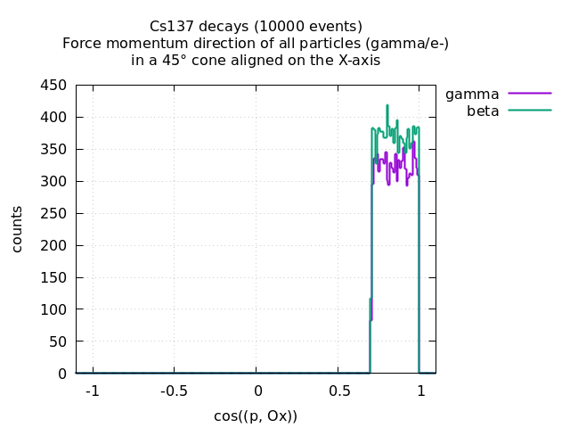
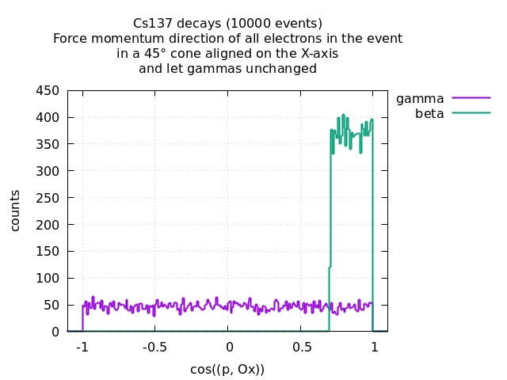
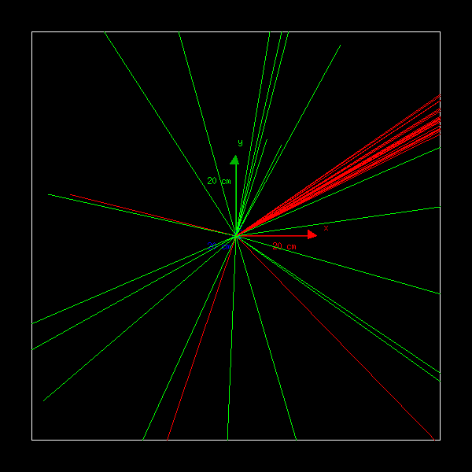

=========================================================
Momentum Direction Lock post-generation event operation
=========================================================

:author: F.Mauger
:date: 2021-04-30

Examples with Cs137 decays
==========================

The emission cone is set along the X-axis with a 45° angle of aperture:

Selected particle code: gamma, rank=0
-------------------------------------

   The target particle is the first occurence of a gamma in the event,
   if it exists. Its momentum  is forced within the requested emission
   cone.  All other  particles are rotated to  preserve their relative
   angles with the target particle.
 
   .. image:: test_decay0_generator_mdl.png
      :width: 90%

.. raw:: pdf
	 
   PageBreak
..
	    
	 
Selected particle code: undefined (particle of any type), rank=-1 (no rank)
------------------------------------------------------------------------------

All particles  of whatever types  in the event have  their momentum
forced in the requested emission  cone. All other particles are let
unchanged.

	  
 
.. raw:: pdf
	 
   PageBreak
   
..
  

Selected particle type: electrons, rank=-1 (no rank)
------------------------------------------------------------------------------

All  electrons in  the  event  have their  momentum  forced in  the
requested  emission  cone. All  other  particles  (gammas) are  let
unchanged.
   

	   	  
..

.. raw:: pdf
	 
   PageBreak
   
..

Display from the Geant4 visualization driver
------------------------------------------------------------------------------

Twenty Cs137 decays are shot from the origin of the geometry setup.
The first emitted gamma rays are  forced to be uniformly emitted in
a  preferred direction,  letting  the emitted  electrons rotate  to
preserve their original angle with the target gamma.
   
   

	  
..
