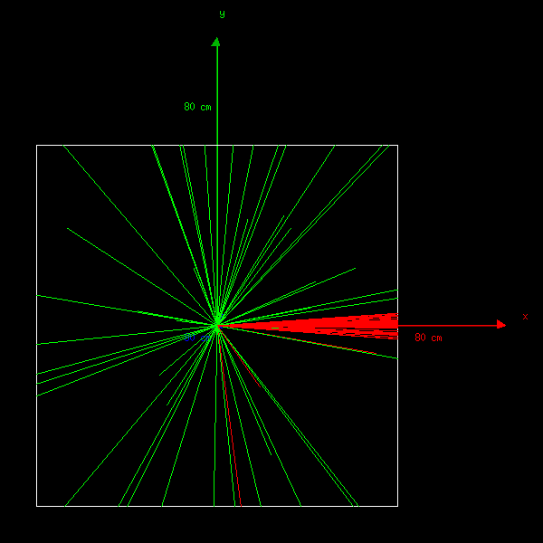
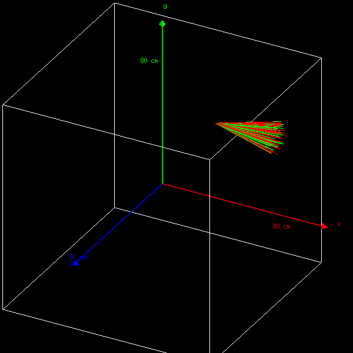

=========================================================
BxDecay0_Geant4 - Example 01 - bxdecay0_g4_ex01 
=========================================================
			    
This example uses the BxDecay0 event generator within Geant4.
It is inspired by the Geant4  ``extended/radioactivedecay/rdecay01`` example.
 
 
1 - Geometry construction
=============================

It is a simple  ``World`` box which represents an 'infinite' homogeneous medium.
  
2 - Physics list
================

PhysicsList.cc   defines  G4Transportation   processes  and   relevant
particle definitions.   Therefore, once  created, particles  travel as
geantino.
         	
3 - Primary generator
=====================
 
There  is  no default  decay  kinematic.   A specific  BxDecay0  decay
process can be set with ``/bxdecay0/generator/`` commands.
         	
4 - Physics
===========

As said above,  all particles behave as geantino, eg.  no energy loss.
Few  macros are  given  in  example. ``debug.mac``  is  to  be run  in
interactive mode.
 
5 - Messenger commands
----------------------
 
5.a - Verbosity
~~~~~~~~~~~~~~~

Users  can  set the verbosity level of the  BxDecay0  generator driver  via  the
``/bxdecay0/generator/verbosity`` command which takes one unique verbosity level parameter.

Example:

.. code:: shell
	  
   /bxdecay0/generator/verbosity 2 # For debug printing
..
  
 
5.b - Decay generator settings
~~~~~~~~~~~~~~~~~~~~~~~~~~~~~~

Users  can   redefine  the  BxDecay0  generator  behaviour,  via  the
``/bxdecay0/generator/`` decay generator configuration commands :

* ``/bxdecay0/generator/background`` : Set the *background* nuclide (examples: C14, Co60, Cs137...)
* ``/bxdecay0/generator/dbd`` : Set the *dbd* (double  beta decay) nuclide (examples: Mo100, Se82, Ge76...)
* ``/bxdecay0/generator/dbdranges`` : Set the *dbd* (double  beta decay) nuclide with a final
  energy sum in a limited range of kinetic energy (examples: [2.3,3.2], energies are in MeV)

The table below details the supported parameters for these commands:

=========== ========= ========== ========== =========== ================ ================ ==========
              nuclide    seed     dbd_mode   dbd_level   dbd_min_energy   dbd_max_energy   debug
=========== ========= ========== ========== =========== ================ ================ ==========
 Type         string     integer   integer    integer     real             real             boolean
 Default      no         no        no         no          no               -1.0             false  
----------- --------- ---------- ---------- ----------- ---------------- ---------------- ----------
 background   yes        yes       N/A        N/A         N/A              N/A              yes
 Example      "Co60"     314159    N/A        N/A         N/A              N/A              false
----------- --------- ---------- ---------- ----------- ---------------- ---------------- ----------
 dbd          yes        yes       yes        yes         N/A              N/A              yes
 Example      "Mo100"    951413    1          0           N/A              N/A              false
----------- --------- ---------- ---------- ----------- ---------------- ---------------- ----------
 dbdranged    yes        yes       yes        yes         yes              yes              yes
 Example      "Se82"     123456    4          0           2.4              3.0              false
=========== ========= ========== ========== =========== ================ ================ ==========
  
  
Geant4 macro examples:

* BxDecay0 decay process from the  *background* decay category:
  
  .. code:: shell
	    
     /bxdecay0/generator/background Co60 314159
     /run/beamOn 10
  ..

* BxDecay0 neutrinoless double beta decay process of Mo-100 from the  *dbd* decay category:
  
  .. code:: shell
	    
     /bxdecay0/generator/dbd Mo100 951413 1 0
     /run/beamOn 10
  ..

* BxDecay0 two-neutrino double beta decay process  of Se-82 with a limited range on
  the generated sum energy from the *dbd* decay category:
  
  .. code:: shell
	    
     /bxdecay0/generator/dbdranged Se82 123456 4 0 2.4 3.0 
     /run/beamOn 10
  ..
  
 
Examples of such files are given in subdirectory ``macros``. 

6 - MDL biasing
=================

As an option, BxDecay0 provides the MDL mechanism (Momemtum Direction Locking)
which enables to enforce the momentum direction of some, or all, generated primary particles
in the BxDecay0 generated event, at user choice. 

**Example:** Force each first electron in each event to be emitted in a cone along
the X-axis and rotate the full event to preserve angular correlations between emitted particles.

.. code:: shell

   /vis/viewer/set/viewpointThetaPhi 0. 90.
   /vis/scene/add/axes 0 0 0 80 cm	    
   /bxdecay0/generator/verbosity 2
   /bxdecay0/generator/background Cs137 314159
   /bxdecay0/generator/mdl electron 0 0.0 90.0 5.0 false
   /bxdecay0/upvg/vertex 20.0 30.0 -10.0 cm
   /run/beamOn 50
..
  

 

7 - Vertex generator
====================

The BxDecay0 library does not manage  the emission point of any decay.
It does not know anything about the specific geometry you are using in
your simulation  program.  It  is thus  up to you  to define  a proper
vertex generator algorithm/class in your Geant4 simulation program.

As  a convenience,  the BxDecay0/Geant4  extension library  provides a
special interface to allow you to install your own vertex generator in
the      primary     event      generator      class     (see      the
``bxdecay0_g4::PrimaryGeneratorAction::SetVertexGenerator(...)``
methods).

The  ``bxdecay0_g4::VertexGeneratorInterface``  abstract interface  is
defined  in  the ``bxdecay0_g4/vertex_generator_interface.hh``  header
file.   A concrete  and operational  use case  (arbitrary, non-random,
point-like       vertex)       is        provided       with       the
``bxdecay0_g4::UniquePointVertexGenerator``        class.         This
``bxdecay0_g4_ex01`` example (see  the ``ActionInitialization`` class)
shows  how   to  install  such   a  vertex  generator  class   in  the
BxDecay0/Geant4 primary generator action.

**Example:** Similar to the previous example but sets the emission vertex at a specific point
in the geometry, using the ``/bxdecay0/upvg/vertex`` command.

.. code:: shell

   /vis/viewer/set/viewpointThetaPhi  40. 50.
   /vis/scene/add/axes 0 0 0 80 cm	    
   /bxdecay0/generator/background Cs137 314159
   /bxdecay0/generator/mdl all -1 0.0 90.0 5.0 false
   /bxdecay0/upvg/vertex 20.0 30.0 -10.0 cm
   /run/beamOn 50
..

 

 

8 - Visualisation
=================

!!! NOT TESTED YET !!!

Visualization Manager is set in the ``main()``.  Initialisation of the
drawing  is   done  via   the  commands   ``/vis/..``  in   the  macro
``vis.mac``. This macro  is automatically read from  the main function
in case of interactive running mode.
 
 * *e-* : red
 * *e+* : blue
 * *gamma* : green
 * *alpha* : yellow

   
9 - How to start ?
==================
 
- Execute ``bxdecay0_g4_ex01`` in *batch* mode from macro files:

  .. code:: bash
	    
     $ bxdecay0_g4_ex01 macros/Co60.mac
  ..
 
- Execute  ``bxdecay0_g4_ex01`` in *interactive mode* with visualization:

  .. code:: bash
	    
     $ bxdecay0_g4_ex01 
     ....
     Idle>   ---> type your commands. For instance:
     Idle> /control/execute macros/debug.mac 
     ....				
     Idle> exit
  ..

10 - Histograms
=====================

``bxdecay0_g4_ex01`` produces several 1D-histograms which are saved as
``bxdecay0_g4_ex01.root`` by default.

* 1 : energy spectrum for *e-*
* 2 : energy spectrum for *e+* 
* 3 : energy spectrum for *gamma*
* 4 : energy spectrum for *alpha*
        
  The histograms are managed by ``G4AnalysisManager`` and its *Messenger*. 
  The histos can be individually activated with the command :

  ::

     /analysis/h1/set id nbBins  valMin valMax unit
     
  ..
   
  where unit is the desired unit for the histo (MeV or keV, deg or mrad, etc..)
   
  One can control the name of the histograms file with the command:

  ::

     /analysis/setFileName  name  (default ``bxdecay0_g4_ex01``)
     
  ..
   
  It is possible to choose the format of the histogram file : root (default),
  xml, csv, by using namespace in ``HistoManager.hh``
   
  It is also possible to print selected histograms on an ascii file:

  ::
      
     /analysis/h1/setAscii id
     
  ..
   
  All selected histos will be written on a file ``name.ascii`` (default ``bxdecay0_g4_ex01``).

11 - Build the example
============================

#. Configure:

   .. code:: bash

      $ mkdir _build.d
      $ cd _build.d
      $ cmake \
           -DBxDecay0_DIR="$(bxdecay0-config --cmakedir)" \
           -DGeant4_DIR="$(geant4-config --prefix)/lib" \
	   ..
      $ make
   ..

.. end
   
