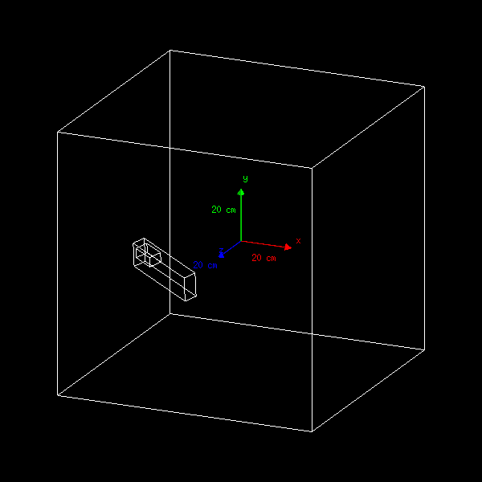
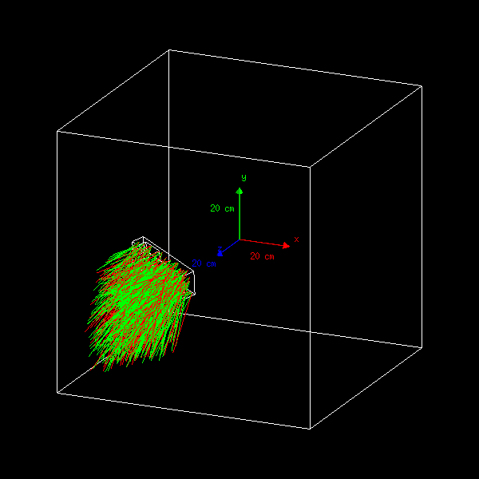
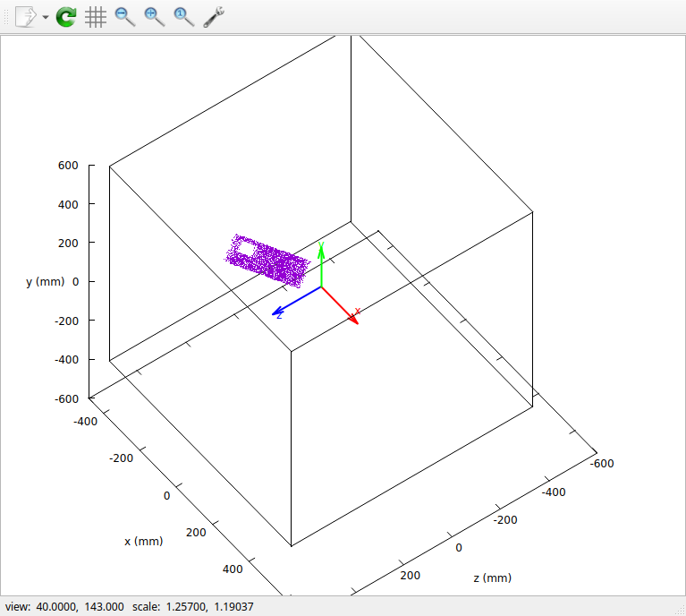

=========================================================
BxDecay0_Geant4 - Example 02 - bxdecay0_g4_ex02 
=========================================================
			    
This example uses  the BxDecay0 event generator within  Geant4.  It is
inspired  by  the  ``bxdecay0_g4_ex01``   example.  It  illustrates  a
possible implementation  of a specific vertex  generator associated to
the BxDecay0 particle generator.
 
 
1 - Geometry construction
=============================

The  geometry setup  consists  in  a simple  ``World`` box  which represents  an
'infinite' homogeneous medium with a single box volume inside
(see the ``DetectorConstruction`` class). This ``Source`` box
itself has a box-shape hole inside.
  

         	
2 - Primary generator
=====================
 
There  is  no default  decay  kinematic.   A specific  BxDecay0  decay
process can be set with ``/bxdecay0/generator/`` commands.

3 - Physics
===========

All particles behave as geantino, eg.  no energy loss.

 
4 - Messenger commands
----------------------

For a description of available messenger commands, see the README file
from the ``bxdecay0_g4_ex01`` example:

**Example:** Generate 10 Cobalt-60 decays and force all emitted particles
in each event to be emitted in a cone in some arbitrary direction and aperture.

.. code:: shell

   /vis/scene/add/axes 0 0 0 20 cm	    
   /bxdecay0/generator/background Co60 314159
   /bxdecay0/generator/mdl all -1 230 90 30
   /run/beamOn 50
..

 

5 - Vertex generator
====================

This example implements the specific ``BoxBulkVertexGenerator`` vertex
generator that allows to randomize vertexes from a box volume which is
associated to a logical volume in the Geant4 geometry setup.

There is an optional flag to reject vertexes generated from the inside
of the logical volume's daughter volumes.

The ``VertexGeneratorRecorder`` wrapper class is provided to allow the
recording of the  generated vertexes in a simple  ASCII formatted file
for debugging purpose.

No messenger is provided for this generator because it is hardcoded in
the main program itself (see the ``ActionInitialization`` class).

**Examples:** Display a few thousands generated vertexes from the bulk
volume  of  the ``Source``  box,  excluding  the  region of  the  hole
(Gnuplot). The  trajectories of the  primary particles generated  by the
BxDecay/Geant4 driver are not shown here.
 

 
 
6 - Build the example
============================

#. Configure:

   .. code:: bash

      $ mkdir _build.d
      $ cd _build.d
      $ cmake \
           -DBxDecay0_DIR="$(bxdecay0-config --cmakedir)" \
           -DGeant4_DIR="$(geant4-config --prefix)/lib" \
	   ..
      $ make
   ..

.. end
   
